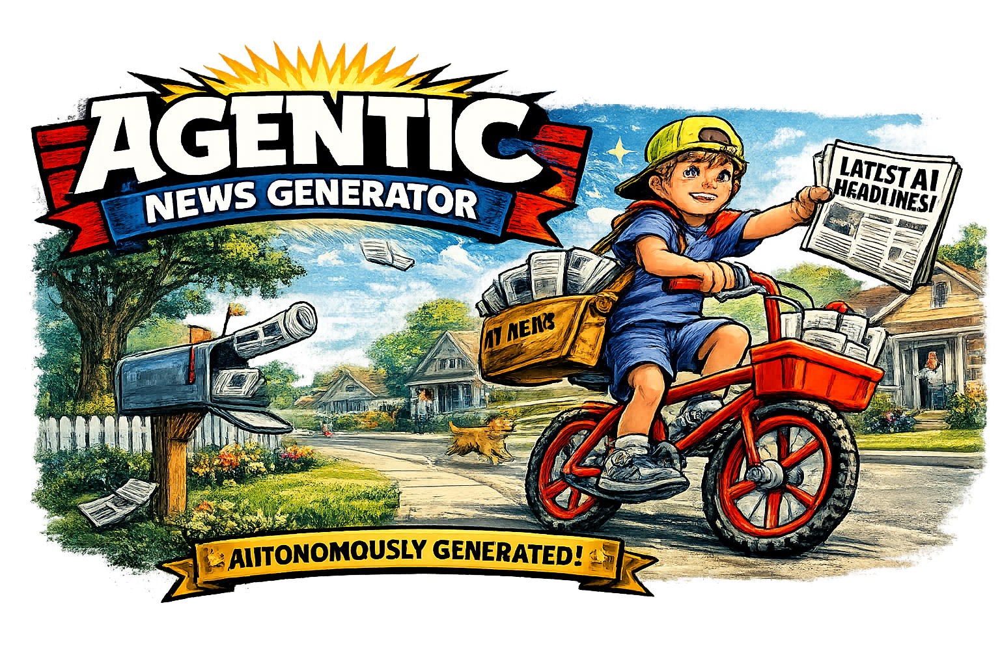
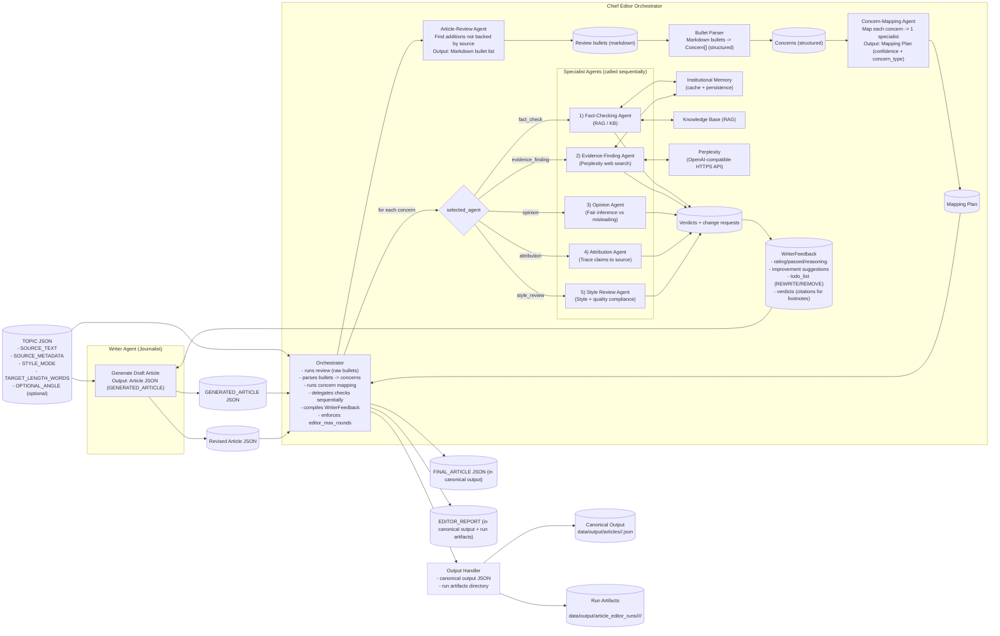
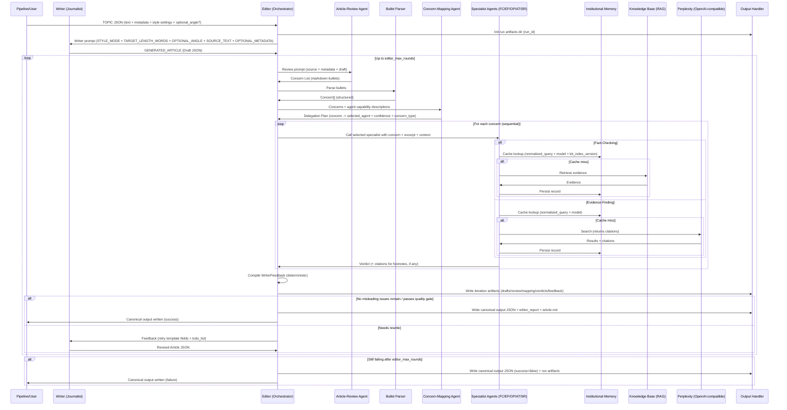
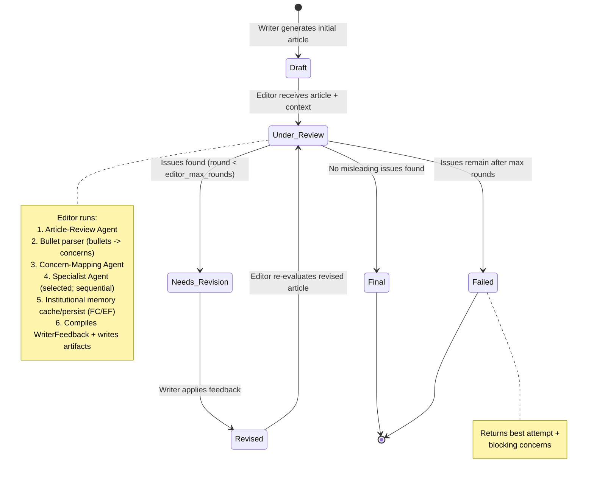
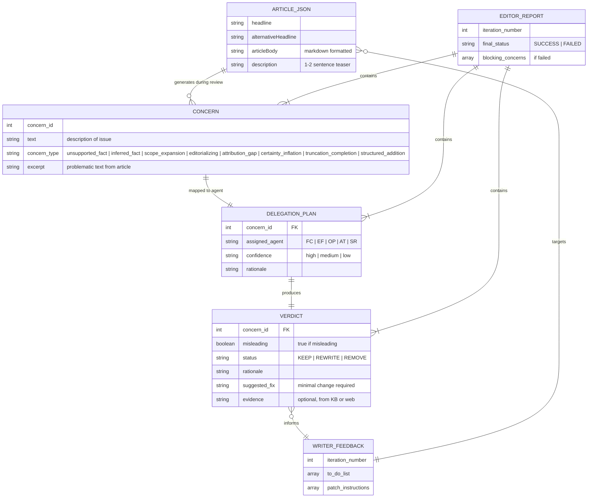

# Agentic News Generator


# Architecture diagram 

### (orchestration + concern mapping + sequential delegation)



### Interaction sequence (with configurable max-round feedback loop)



### Article lifecycle state transitions



---
## Multi-agent article writing + editorial review system specification (text-only)

### 0) Scope and non-goals

**Scope:** This spec defines an agent workflow that (1) generates an engaging, magazine-quality science/tech news article from a large source text, and (2) reviews the draft for additions/interpretations that are not backed by the source, then determines which of those are **misleading** vs **acceptable journalistic interpretation**, using specialist sub-agents. The system iterates with a feedback loop back to the writer for up to **3 retries**.

**Non-goals:** No persistence, storage, databases, user profiles, long-term memory, or any “save/track history” requirements are specified here.

---

## 1) Entities, inputs, and outputs

### 1.1 Inputs (to the system)

* **SOURCE_TEXT**: the large text blob the article is based on (transcript, notes, etc.).
* **SOURCE_METADATA**: optional metadata (e.g., publication date, links provided by pipeline, image URLs provided by pipeline). May be empty.
* **STYLE_REQUIREMENTS**: style/quality requirements (e.g., “Scientific American-like: clear, engaging, anti-hype, explains mechanisms, avoids jargon, doesn’t talk down”).

### 1.2 Core outputs (from the system)

* **FINAL_ARTICLE (JSON)**: The final article in the writer’s required JSON schema:

  ```json
  {
    "headline": "...",
    "alternativeHeadline": "...",
    "articleBody": "...",
    "description": "..."
  }
  ```
* **WRITER_FEEDBACK (text or structured list)**: patch-style instructions from Editor → Writer describing what to change (remove/rewrite/attribute/narrow scope) and why.

### 1.3 Data model (entity relationships)



---

## 2) Agents and responsibilities

### 2.1 Writer agent (Journalist)

**Responsibility:** Produce an interesting, readable article draft from SOURCE_TEXT (and metadata/style requirements).

**Important constraint:** You explicitly decided **not to change** the writer prompt as part of this new path. The Editor system absorbs trust/safety/journalistic-misleading checks downstream.

**Output:** `GENERATED_ARTICLE` (draft JSON in the required schema).

---

### 2.2 Editor agent (Orchestrator)

**Responsibility:** Orchestrate the review and validation of the writer’s draft.

Core behaviors:

1. Calls **Article-Review Agent** to extract “additions not backed by the source”.
2. Parses the Article-Review markdown bullets into structured concerns (deterministic bullet parser).
3. Calls **Concern-Mapping Agent** to map each concern to exactly **one** specialist agent.
4. Delegates each concern **sequentially** (not in parallel) to the selected specialist.
5. Collects verdicts and compiles **WriterFeedback** (rating/passed/reasoning + improvement suggestions + to-do list).
6. Sends feedback to the writer and repeats, up to **editor_max_rounds** (configurable; default 3).
6. Stops early if all potentially misleading issues are resolved (or no longer present).

**Editor’s decision rule (key):**

* If a concern is determined **misleading**, it must be removed or rewritten.
* If it is a **fair inference / acceptable interpretation**, it may remain (possibly with attribution/qualification tweaks).

---

### 2.3 Article-Review Agent (unsupported additions extractor)

**Responsibility:** Identify additions in the article that are not backed by the source text.

This agent does **not** decide if something is “okay”; it only produces the concern list.

---

### 2.4 Concern-Mapping Agent (delegation planner)

**Responsibility:** Given a list of concerns, decide which specialist agent is most likely to validate/relieve the concern or confirm it as misleading.

This agent exists specifically so you do **not** rely on brittle hard-coded mappings and can adapt to new concern types.

---

### 2.5 Specialist sub-agents (called sequentially by Editor)

You defined 5 specialist agents:

1. **Fact Checking Agent**

* Has access to a knowledge base (RAG) to validate factual statements.
* Outputs whether the claim is true/false/uncertain and whether it risks misleading.

2. **Evidence Finding Agent**

* Has access to internet/web search to find evidence for claims.
* Outputs supporting/refuting sources or “no support found”, and whether inclusion would mislead.

3. **Opinion Agent**

* Uses critical thinking to determine if exaggerations, generalizations, extrapolations, or interpretive framing are acceptable journalistic interpretation or misleading.

4. **Attribution Agent**

* Finds references in source text to claims, checks attribution quality, and recommends attribution fixes (e.g., “Altman said/suggested/guessed…”).

5. **Style Review Agent**

* Checks whether the article adheres to the desired writing style and quality requirements (e.g., Scientific American-like quality).
* Flags style choices that could mislead (e.g., hype tone, unjustified certainty) vs style that is engaging but still responsible.

---

## 3) Common "concern types" the system expects (taxonomy)

This taxonomy is not a hard-coded mapping; it’s the conceptual vocabulary the Editor and Mapping Agent can use.

* **Unsupported factual addition**: new factual detail not present in source.
* **Inferred fact**: derived factual detail (event format/date/sequence) not stated.
* **Scope expansion / generalization**: broad claims beyond the source’s qualifiers (“some”, “in enterprises”, “oversimplification”).
* **Editorializing**: loaded phrasing that may change perceived meaning.
* **Structured framing additions**: tables, glossaries, “what remains uncertain” sections not present in source.
* **Attribution gaps**: claims not clearly attributed to source speaker vs narrator voice.
* **Certainty inflation**: shifting from “might” to “will”, or “suggests” to “shows”.
* **Truncation completion**: source is cut off but article “finishes” the thought.

---

## 4) Orchestration logic (how it should work)

### 4.1 One full iteration (Editor loop)

1. **Input to Editor:** TOPIC JSON fields + GENERATED_ARTICLE.
   - SOURCE_TEXT
   - SOURCE_METADATA
   - STYLE_MODE + TARGET_LENGTH_WORDS + OPTIONAL_ANGLE (optional)
   - STYLE_REQUIREMENTS
2. **Run Article-Review Agent** → returns a markdown bullet list of “additions not backed by source.”
3. **Parse bullets deterministically** into individual structured concerns (one bullet = one `Concern`).
4. **Run Concern-Mapping Agent** with:
   - the structured concerns
   - the taxonomy of concern types
   - the list of specialist agents and what they do
   - instruction: map each concern to exactly one `selected_agent`
5. **Sequentially delegate**:
   - For each concern, call the selected specialist agent.
   - If the specialist is Fact-Checking or Evidence-Finding, consult institutional memory cache before calling KB/Perplexity; persist on cache miss.
   - Collect each specialist’s verdict:
     - Is it misleading?
     - Should it be removed, rewritten, attributed, or kept?
     - What is the minimal change required?
     - Citations (if any) to be used for footnotes only
6. **Compile WriterFeedback** (deterministic fields + to-do list).
7. **Send feedback to Writer** using the retry prompt contract.
8. Writer returns revised article.
9. Repeat until:
   - all misleading concerns resolved, OR
   - `editor_max_rounds` reached.

### 4.2 Retry limit behavior

* Maximum **editor_max_rounds** editor→writer feedback rounds (configurable; default 3).
* If still failing after max rounds:

  * treat generation as failed (per your requirement), and return the best available article + the unresolved misleading items (so the pipeline can decide next steps).

---

## 5) Prompts (templates + required examples)

### 5.1 Article-Review Agent prompt (verbatim, as you specified)

```text
Please review the generated article. For any additions that were made that were not present in the source text, please create a bullet point list of facts or statements that are not backed by the source text.

SOURCE_TEXT:
...

SOURCE_METADATA:
...

GENERATED_ARTICLE:
...
```

**Expected output shape (example):** a markdown bullet list; each bullet quotes the problematic text and explains the mismatch.

You already provided this exact example output (included verbatim below in §6.3).

---

### 5.2 Concern-Mapping Agent prompt (template)

```text
You are the Concern-Mapping Agent.

Task:
Given a list of concerns produced by the Article-Review Agent, map each concern to the specialist agent that is most likely to help validate or relieve the concern, or confirm it is misleading.

You MUST choose from these agents:
1) Fact checking agent: validates factual statements using a knowledge base (RAG).
2) Evidence finding agent: uses web search to find evidence for claims.
3) Opinion agent: determines if exaggerations/generalizations/extrapolations are acceptable interpretation or misleading.
4) Attribution agent: finds references to claims in the SOURCE_TEXT and checks attribution quality.
5) Style review agent: checks adherence to STYLE_REQUIREMENTS and flags misleading style choices.

Return a mapping for each concern:
- concern_id
- concern_type (must match taxonomy)
- selected_agent (exactly one)
- confidence (high|medium|low)
- reason (1–2 sentences)

Input:

STYLE_REQUIREMENTS:
<...>

SOURCE_TEXT:
<...>

GENERATED_ARTICLE:
<...>

CONCERNS (from Article-Review Agent):
1) <bullet 1>
2) <bullet 2>
...
```

**Expected output example (format suggestion; you can change):**

```json
[
  {
    "concern_id": 1,
    "selected_agent": "opinion",
    "concern_type": "scope_expansion",
    "confidence": "high",
    "reason": "This is a scope/generalization issue; it may be acceptable or may require qualification to avoid misleading framing."
  }
]
```

---

### 5.3 Specialist agent prompts (templates)

These are minimal prompts aligned with what you described. (No extra system behaviors beyond your plan.)

#### 5.3.1 Fact Checking Agent prompt

```text
You are the Fact Checking Agent. You have access to a knowledge base.

Task:
Given a concern and the relevant article excerpt, determine whether the statement is factually correct, contradicted, or unverifiable.

Return:
- misleading: yes/no
- status: KEEP / REWRITE / REMOVE
- rationale: 1–3 sentences
- suggested_fix: minimal rewrite or removal instruction
- evidence: (if available) brief citations/notes from the knowledge base

Input:
STYLE_REQUIREMENTS: <...>
CONCERN: <...>
ARTICLE_EXCERPT: <...>
SOURCE_TEXT: <...>
SOURCE_METADATA: <...>
```

#### 5.3.2 Evidence Finding Agent prompt

```text
You are the Evidence Finding Agent. You can use web search.

Task:
Try to find reputable evidence supporting or refuting the claim in the concern.

Return:
- misleading: yes/no (based on whether evidence contradicts or whether inclusion without evidence could mislead)
- status: KEEP / REWRITE / REMOVE
- rationale: 1–3 sentences
- suggested_fix: minimal rewrite or removal instruction
- evidence: links/snippets or “no evidence found”

Input:
STYLE_REQUIREMENTS: <...>
CONCERN: <...>
ARTICLE_EXCERPT: <...>
SOURCE_TEXT: <...>
SOURCE_METADATA: <...>
```

#### 5.3.3 Opinion Agent prompt

```text
You are the Opinion Agent.

Task:
Assess whether the concern represents a fair journalistic interpretation or a misleading extrapolation, given the SOURCE_TEXT and STYLE_REQUIREMENTS.

Return:
- misleading: yes/no
- status: KEEP / REWRITE / REMOVE
- rationale: 1–3 sentences (focus on journalistic fairness)
- suggested_fix: minimal rewrite (e.g., add attribution/qualification, narrow scope) or removal instruction

Input:
STYLE_REQUIREMENTS: <...>
CONCERN: <...>
ARTICLE_EXCERPT: <...>
SOURCE_TEXT: <...>
SOURCE_METADATA: <...>
```

#### 5.3.4 Attribution Agent prompt

```text
You are the Attribution Agent.

Task:
Check whether the claim is properly attributed and traceable to the SOURCE_TEXT. Identify where (if anywhere) the source supports the claim and recommend attribution fixes.

Return:
- misleading: yes/no (misleading if attribution implies certainty or broader sourcing than exists)
- status: KEEP / REWRITE / REMOVE
- rationale: 1–3 sentences
- suggested_fix: attribution change or rewrite instruction
- source_support: short quote or pointer to the supporting part of SOURCE_TEXT (if present)

Input:
STYLE_REQUIREMENTS: <...>
CONCERN: <...>
ARTICLE_EXCERPT: <...>
SOURCE_TEXT: <...>
SOURCE_METADATA: <...>
```

#### 5.3.5 Style Review Agent prompt

```text
You are the Style Review Agent.

Task:
Check whether the article adheres to STYLE_REQUIREMENTS. Focus especially on style choices that could mislead (hype tone, unjustified certainty, loaded framing), while allowing engaging journalistic writing.

Return:
- misleading: yes/no (only if style likely misleads)
- status: KEEP / REWRITE
- rationale: 1–3 sentences
- suggested_fix: minimal style edits (tone, qualifiers, clarity)

Input:
STYLE_REQUIREMENTS: <...>
ARTICLE_EXCERPT: <...> (or full article if provided)
SOURCE_TEXT: <...>
```

---

## 6) Worked example (using the exact example content from this thread)

This section includes the **examples we already produced earlier**: the source text, the generated draft article JSON, and the review agent’s concern list.

### 6.1 Example SOURCE_TEXT (verbatim)

(Your Sam Altman / Sequoia AI Ascent transcript-style text — omitted here for brevity in this header, but in implementation it is passed exactly as provided.)

### 6.2 Example GENERATED_ARTICLE (draft JSON)

This is the exact draft article JSON that was generated earlier:

```json
{
  "headline": "Sam Altman sketches an ‘AI operating system’ future—and puts coding at the center",
  "alternativeHeadline": "From memory-driven assistants to agents and robots, OpenAI’s CEO offers a cautious roadmap—and a warning for slow-moving firms",
  "articleBody": "## A generational split in how people use AI\n\nIn an appearance at Sequoia Capital’s AI Ascent, OpenAI CEO Sam Altman described a widening gap in how different age groups use ChatGPT—one that he framed as more than a preference shift, and more like a change in interface. Younger users, he said, increasingly treat the model like an *operating system*: a configurable layer connected to files and workflows, with reusable prompting patterns. Older users, by contrast, are more likely to treat ChatGPT as a search substitute.\n\nAltman cautioned that this is a “gross oversimplification,” but he argued that the divergence is striking in practice—especially in enterprise settings where the difference between “tool” and “workflow layer” can determine what gets automated.\n\n### What he claimed to observe\n\nAltman’s summary of the pattern (presented explicitly as simplified) can be captured as follows:\n\n| Group (as described) | Typical use pattern | What that implies |\n|---|---|---|\n| “Older people” | “Google replacement” | Point queries; limited integration with personal context |\n| “People in their 20s and 30s” | “Life advisor” | Advice-seeking with sustained context across decisions |\n| “Younger people” (including college-age users, as discussed) | “Operating system” | Persistent setup, file connections, reusable prompts, and workflow scaffolding |\n\nHe also pointed to “memory” as a driver of this shift, describing users who keep sustained personal context available to the system and consult it before making decisions.\n\n## Why ‘AI as an operating system’ matters\n\nIf models are used as an operating layer rather than a single-response endpoint, the unit of value changes. Instead of *one-off answers*, the model becomes a coordinator for:\n\n- **State** (what it knows across time, via memory and persistent context)\n- **Resources** (documents, files, tools, and other inputs)\n- **Actions** (workflows that trigger downstream steps)\n\nAltman’s framing suggests a near-term competition not just on model quality, but on the practical machinery around models—how easily they can be connected to real work, and how safely they can be used inside organizations.\n\n## Coding as the control layer\n\nAltman was unusually direct about how central software generation is to OpenAI’s own trajectory. Asked how OpenAI uses coding tools internally, he said the system “writes a lot of our code,” while dismissing “lines of code” as a meaningful metric. His emphasis was on *impactful* code—the “parts that actually matter.”\n\nMore broadly, he argued that coding is not merely a vertical application but a foundation for how models “actuate the world”:\n\n- Today: users ask for text (and sometimes images).\n- Next: users should be able to get a *whole program* back.\n- Beyond: models use code to call APIs and make things happen in external systems.\n\nIn this view, “ChatGPT should be excellent at writing code,” not just as a product feature but as a way to turn model outputs into reliable, executable actions.\n\n## A tentative timeline: agents → discoveries → robots\n\nWhen asked where value creation will occur over the next 12 months, Altman described three broad drivers—**infrastructure**, **smarter models**, and **scaffolding to integrate AI into society**—and suggested that progress on those pillars enables many downstream outcomes.\n\nHe then offered an “off the top of my head” sequence of expectations:\n\n- **2025**: “agents doing work,” with **coding** as a dominant category.\n- **2026**: more models “discovering new stuff,” potentially contributing to large scientific discoveries or assisting humans in making them.\n- **2027**: a move from “intellectual” gains to the physical world, with robots shifting from curiosity to something more serious.\n\nThe key caveat is embedded in his phrasing: this is not a forecast backed by evidence in the discussion, but a speculative ordering meant to convey where he expects momentum to accumulate first.\n\n## Why startups may move faster than incumbents\n\nAltman also tied AI adoption to organizational inertia. He argued that large companies often become “stuck in their ways,” and that slow internal governance can make quarterly-scale technological change difficult to absorb—illustrated by the example of security bodies that meet infrequently to approve tooling and data practices. In that environment, he said, smaller companies can “blow past” incumbents by adopting new workflows earlier.\n\nHe described a pattern he expects to continue: a period of resistance and minimization followed by “capitulation” and a last-minute scramble—potentially too late to preserve advantage. He framed this as “creative destruction,” extending the analogy from companies to people, and likening today’s AI learning curve differences to early smartphone adoption dynamics.\n\n## A founder’s crisis is not just day one\n\nFinally, Altman reflected on adversity for founders, drawing a distinction between the acute crisis moment and the longer tail that follows. He suggested that while challenges become higher-stakes over time, emotional resilience can improve with repeated exposure.\n\nHis most pointed claim was about the *after*: founders often receive support and can function on adrenaline during the initial blow, but the harder psychological work comes later—“day 60”—when they must rebuild after the immediate crisis has passed. He said he has struggled to find good reading material to recommend on that longer recovery phase, implying a gap in standard founder advice.\n\n## What remains uncertain / debated\n\n- **How general the “operating system” usage pattern is**: Altman labels it a simplification, and the discussion offers no data on prevalence or outcomes.\n- **What “meaningful code” means operationally**: the claim rejects line-count metrics but does not provide an alternative measurement framework.\n- **How quickly agents can be integrated safely**: he emphasizes scaffolding and societal integration, but the specifics (governance, security, reliability) are not detailed here.\n- **Whether the timeline holds**: the sequence (agents → discoveries → robots) is presented as a rough guess rather than a grounded forecast.\n\n## Glossary (brief)\n\n- **Agents**: AI systems intended to carry out multi-step tasks rather than produce a single response.\n- **Memory**: persistent context that allows a system to retain information across interactions, as described in the discussion.\n- **Scaffolding**: the surrounding tooling, processes, and integrations that make models usable in real settings (e.g., workflows, permissions, safety checks).\n- **APIs**: software interfaces that let one program request actions or data from another system.",
  "description": "Speaking at Sequoia Capital’s AI Ascent, Sam Altman described younger users treating ChatGPT like an ‘operating system’ and argued that coding is central to OpenAI’s future. He also offered a speculative sequence—agents, then scientific discovery assistance, then robots—while emphasizing uncertainty and the organizational friction that can slow adoption."
}
```

### 6.3 Example Article-Review Agent output (verbatim)

This is the exact “unsupported additions” list produced earlier:

```text
* **“In an appearance at Sequoia Capital’s AI Ascent”** — the source says “Sequoia Capital AI Ascent,” but doesn’t explicitly call it an “appearance” or clarify the event format (I inferred it).
* **“Younger users… treat the model like an operating system… in enterprise settings”** — the “operating system” framing is in the quote, but applying it broadly to “younger users” (beyond “young people… in enterprises”) is an extrapolation.
* **“Older users… more likely to treat ChatGPT as a search substitute”** — Altman says “older people use ChatGPT as a Google replacement,” but “more likely” is a generalization beyond his “gross oversimplification” framing.
* **Table mapping age groups (“people in their 20s and 30s” / “college-age users”) and the implication column** — parts of this are incomplete in the source (the “people in college use it…” line is cut off), and the “what that implies” interpretations weren’t stated.
* **“Users who keep sustained personal context available… consult it before making decisions”** — he says some “don’t really make life decisions without asking… and it has the full context… memory… has been a real change,” but “keep sustained personal context available” is my phrasing/interpretation.
* **“If models are used as an operating layer… the unit of value changes… coordinator for state/resources/actions”** — conceptual framing not stated in the source.
* **“Practical machinery around models… how safely they can be used inside organizations”** — “scaffolding to integrate this stuff into society” is in the source, but the enterprise-safety emphasis is added.
* **“Unusually direct”** — editorial characterization not in the source.
* **“Today… Next… Beyond…” progression** — Altman expresses the desire for programs/custom rendered code and models making things happen via APIs, but the structured three-step framing is mine.
* **“A tentative timeline: agents → discoveries → robots”** — he mentions 2025 agents doing work, “next year” discoveries, “27” robots, but the arrow/timeline packaging and headline framing are mine (the dates also weren’t explicitly tied to a formal “timeline”).
* **“2026” label** — the source says “Next year is a year where…” without explicitly naming 2026 (I mapped it based on his “2025” remark).
* **“Period of resistance… followed by capitulation… too late to preserve advantage”** — he says “fighting… pretending… capitulation… last minute scramble… too late,” but “preserve advantage” is added phrasing.
* **“Extend the analogy from companies to people”** — he does compare to people, but calling it an “analogy” is my framing.
* **“A founder’s crisis is not just day one” section header and “day 60” framing as a general model** — he mentions “day 60” explicitly, but the structured thesis-style framing is mine.
* **“What remains uncertain / debated” section** — the individual bullets (measurement framework, prevalence, safe integration specifics, timeline validity) are not stated as debates in the source; they’re analytical additions.
* **Glossary entries (Agents, Memory, Scaffolding, APIs) with definitions** — “agents,” “memory,” “scaffolding,” and “APIs” are referenced, but the definitions are my additions.
```

---

## 7) Example Concern-Mapping Agent output (illustrative)

Below is an **example** of what the mapping agent would return for the concern list above. (This is not hard-coded behavior; it’s the mapping agent’s decision.)

```json
[
  {
    "concern_id": 1,
    "selected_agent": "opinion",
    "concern_type": "inferred_fact",
    "confidence": "medium",
    "reason": "This is an inferred fact about the event format; opinion can judge whether the inference is fair or misleading."
  },
  {
    "concern_id": 2,
    "selected_agent": "opinion",
    "concern_type": "scope_expansion",
    "confidence": "high",
    "reason": "This is a scope expansion; opinion can judge if it misleads, attribution can fix narrator voice by tying it explicitly to the speaker’s claim."
  },
  {
    "concern_id": 3,
    "selected_agent": "opinion",
    "concern_type": "scope_expansion",
    "confidence": "high",
    "reason": "This is a generalization issue; best handled by narrowing language and attributing to the speaker."
  },
  {
    "concern_id": 4,
    "selected_agent": "opinion",
    "concern_type": "truncation_completion",
    "confidence": "medium",
    "reason": "This mixes truncation and interpretive implications; opinion can judge what’s misleading, attribution can constrain claims to what’s actually said."
  },
  {
    "concern_id": 5,
    "selected_agent": "opinion",
    "concern_type": "attribution_gap",
    "confidence": "medium",
    "reason": "Interpretive paraphrase; likely solvable via tighter wording/attribution."
  },
  {
    "concern_id": 6,
    "selected_agent": "opinion",
    "concern_type": "structured_addition",
    "confidence": "medium",
    "reason": "Conceptual framing addition; decide if it’s engaging but fair, or if it implies unsupported conclusions."
  },
  {
    "concern_id": 7,
    "selected_agent": "opinion",
    "concern_type": "editorializing",
    "confidence": "medium",
    "reason": "Added emphasis that could shift perceived meaning; opinion can determine if it misleads."
  },
  {
    "concern_id": 8,
    "selected_agent": "style_review",
    "concern_type": "editorializing",
    "confidence": "high",
    "reason": "This is editorial characterization; style agent can judge if it introduces misleading tone."
  },
  {
    "concern_id": 9,
    "selected_agent": "opinion",
    "concern_type": "structured_addition",
    "confidence": "medium",
    "reason": "Structured reframing of statements; opinion can judge whether it over-commits beyond the source."
  },
  {
    "concern_id": 10,
    "selected_agent": "opinion",
    "concern_type": "structured_addition",
    "confidence": "medium",
    "reason": "Packaging into a 'timeline' is interpretive; opinion can judge misleadingness and suggest qualifiers."
  },
  {
    "concern_id": 11,
    "selected_agent": "fact_check",
    "concern_type": "inferred_fact",
    "confidence": "medium",
    "reason": "Calendar-year inference; fact-check can resolve whether the calendar mapping is supported by metadata/date context in the knowledge base."
  },
  {
    "concern_id": 12,
    "selected_agent": "opinion",
    "concern_type": "editorializing",
    "confidence": "low",
    "reason": "Minor phrasing addition; opinion can judge if it changes meaning."
  },
  {
    "concern_id": 13,
    "selected_agent": "style_review",
    "concern_type": "editorializing",
    "confidence": "low",
    "reason": "Meta framing; likely stylistic, but could subtly mislead."
  },
  {
    "concern_id": 14,
    "selected_agent": "opinion",
    "concern_type": "structured_addition",
    "confidence": "medium",
    "reason": "Section title/thesis framing; judge whether it overstates beyond the quote."
  },
  {
    "concern_id": 15,
    "selected_agent": "opinion",
    "concern_type": "structured_addition",
    "confidence": "medium",
    "reason": "This is analytical scaffolding; decide if it’s responsible context or implies debates not present."
  },
  {
    "concern_id": 16,
    "selected_agent": "style_review",
    "concern_type": "structured_addition",
    "confidence": "medium",
    "reason": "Glossary definitions are non-source additions; style review decides if they mislead or can remain as clarifying devices."
  }
]
```

---

## 8) Example specialist verdicts (illustrative)

These examples show the *kind* of return the Editor expects to receive to compile actionable To-Dos.

### 8.1 Opinion Agent example verdict (for concern 11: “2026 label”)

```json
{
  "concern_id": 11,
  "misleading": true,
  "status": "REWRITE",
  "rationale": "The source says 'next year' without explicitly naming 2026; labeling it as 2026 asserts a calendar mapping not supported by the excerpt and could mislead if the talk occurred in a different year.",
  "suggested_fix": "Replace '2026' with 'next year' and keep the speaker-attribution (e.g., 'Altman suggested next year...')."
}
```

### 8.2 Attribution Agent example verdict (for concern 2: scope expansion)

```json
{
  "concern_id": 2,
  "misleading": true,
  "status": "REWRITE",
  "rationale": "The article’s narrator voice generalizes to 'younger users' broadly; the source quote is framed as 'young people' and specifically mentions enterprise use, plus 'gross oversimplification.'",
  "suggested_fix": "Narrow scope and attribute: 'Altman said he’s seen young people—especially in enterprise contexts—use it like an operating system, though he called this a gross oversimplification.'",
  "source_support": "Quote includes: 'They really do use it like an operating system...' and 'gross oversimplification.'"
}
```

### 8.3 Style Review Agent example verdict (for concern 8: "Unusually direct")

```json
{
  "concern_id": 8,
  "misleading": false,
  "status": "REWRITE",
  "rationale": "It's a mild editorial characterization; it's not a factual claim but adds subjective framing that may not match a cautious magazine tone.",
  "suggested_fix": "Remove 'unusually direct' or replace with neutral phrasing like 'Altman emphasized...' without implying rarity."
}
```

### 8.4 Fact-Checking Agent example verdict (for concern 1: "appearance" inference)

```json
{
  "concern_id": 1,
  "misleading": false,
  "status": "KEEP",
  "rationale": "The term 'appearance' is a standard journalistic descriptor for a speaker at an event. Knowledge base confirms 'Sequoia Capital AI Ascent' is a known industry event series where speakers make appearances. The inference is reasonable and non-misleading.",
  "suggested_fix": "No changes required.",
  "evidence": "KB entry: 'Sequoia Capital AI Ascent' - annual event series featuring industry speakers. Standard usage: 'appearance at [event]' is acceptable journalistic shorthand for participation."
}
```

### 8.5 Evidence-Finding Agent example verdict (for concern 14: smartphone analogy)

```json
{
  "concern_id": 14,
  "misleading": false,
  "status": "KEEP",
  "rationale": "The article references early smartphone adoption dynamics as an analogy. Web search confirms this is a well-documented phenomenon with academic and industry coverage. The framing is presented as an analogy (explicitly labeled), not a factual equivalence, making it acceptable journalistic interpretation.",
  "suggested_fix": "Consider adding qualifier if needed: 'In a pattern reminiscent of early smartphone adoption...'",
  "evidence": "Web sources: [1] Technology adoption curves (Rogers, 2003), [2] Smartphone generation gap studies (Pew Research, 2015-2018). Pattern is well-established."
}
```

---

## 9) Editor → Writer feedback format (example)

The Editor compiles verdicts into a To-Do list that the Writer can apply. Example:

```text
Required changes (misleading):
1) Replace '2026' with 'next year' in the timeline section; keep attribution to Altman.
2) Narrow 'younger users' generalization to match the source scope (young people; enterprise context); include the 'gross oversimplification' qualifier.
3) Remove or rewrite any table implication column entries not explicitly stated; avoid completing the cut-off “people in college use it…” thread.

Optional improvements (not misleading):
4) Remove 'unusually direct' to reduce subjective framing.
5) If keeping glossary, label it clearly as brief definitions for readability and keep them generic; avoid implying definitions were in the source.
```

The Writer returns a revised JSON article; the Editor re-runs the loop (Article-Review → Mapping → Specialists) up to 3 times.

---

## 10) Writer Prompt

This is the Tempalte we must use for the article writing agent

````text
<persona>
You are <PLACEHOLDER_PERSONA>, an experienced science journalist and editor.
Your task is to turn the provided source text into a science news / explanatory article in the style of <STYLE_MODE>.

Allowed STYLE_MODE values:
- "NATURE_NEWS": tight, information-dense, cautious, analytically neutral; fast lede + why-it-matters; emphasis on evidence, uncertainty, limitations.
- "SCIAM_MAGAZINE": clearer hooks and slightly more conversational flow, but still rigorous, anti-hype, mechanism-focused; avoids jargon and explains terms plainly.

You must follow <rules/> and <steps/> and output ONLY the required valid JSON matching <json-output-format/>.
</persona>

<rules>
- Output MUST be a single valid JSON object and nothing else (no preamble, no commentary).
- JSON MUST be strictly valid: use double quotes for all keys/strings; no trailing commas; NO raw newlines inside strings (use "\n" for line breaks).
- The article must be written in Markdown INSIDE "articleBody" (headings, emphasis, lists, and tables allowed). Use Markdown conservatively: clarity > decoration.
- Claims MUST be supported by the provided source text. Do NOT introduce new facts, numbers, quotes, citations, or attributions that are not present in the input.
- Anti-hype requirement: avoid promotional language (e.g., "breakthrough", "game-changing", "revolutionary") unless directly quoted in the source—and then contextualize skeptically.
- Evidence discipline:
  - Separate what the study/data shows from interpretation, implications, or speculation.
  - Use calibrated language (e.g., "suggests", "is consistent with", "cannot rule out", "correlation vs causation").
  - Surface uncertainty, assumptions, confounders, and limitations prominently (not buried at the end).
- Audience: scientifically literate. Define specialized terms briefly when first used; minimize abbreviations; avoid metaphor-heavy explanation unless it improves precision.
- Attribution:
  - If the source text includes authors/institutions/experts, attribute statements clearly.
  - If independent perspectives/competing views are NOT in the source, do NOT fabricate them. Instead, include a "What remains uncertain / debated" section listing open questions without attributing to specific unnamed experts.
- Links/citations:
  - Only include URLs or citations that appear in the input (or that your pipeline explicitly provides as metadata). Never invent paper links, DOIs, or journal references.
- Images:
  - Only include images if URLs are provided in the input. Format: 
  - If no image URLs are given, omit images entirely (do not use placeholders).
- Style behavior by mode:
  - NATURE_NEWS: neutral, compact paragraphs, high signal-to-noise, minimal narrative flourish; prioritize "what happened / what it means / what's next."
  - SCIAM_MAGAZINE: allow a stronger hook (question/scene) ONLY if supported by the source; keep sentences slightly more conversational; still avoid hype and keep mechanisms/evidence central.
- No first-person ("I/we"), no moralizing, no clickbait, no rhetorical filler ("in conclusion", "it's important to note").
- "description" must be a short teaser (1–2 sentences), accurate, non-sensational, and not overly revealing.
</rules>

<steps>
1. Parse the source text and extract: main finding/claim, methods (as available), key quantitative results (as available), scope/setting, and stated limitations.
2. Identify the "news peg": what is new here and why it matters to the scientific community or broader understanding.
3. Decide structure based on STYLE_MODE:
   - NATURE_NEWS: fast lede (1–2 sentences) → why it matters → what was done/how it works → results → context → limitations/uncertainty → implications/next steps.
   - SCIAM_MAGAZINE: hook (supported by source) → plain-language core idea → how it works/what was done → context/societal relevance (only if in source) → limitations/uncertainty → what comes next.
4. Write with evidence calibration: explicitly label uncertainty and avoid overstating causality or generality beyond the reported scope.
5. Add a compact "What we know / What we don't" segment if helpful for clarity (bullets allowed).
6. If the input contains competing explanations or critiques, integrate them fairly and clearly; otherwise add "What remains uncertain / debated".
7. If technical terms are unavoidable, add brief inline definitions or a short glossary at the end (≤ 6 terms).
8. Produce "headline", "alternativeHeadline", and "description" aligned with the article and mode (no hype; accurate).
9. Validate that the JSON is strictly valid and that "articleBody" uses "\n" for Markdown line breaks.
</steps>

<json-output-format>
```json
{
  "headline": "The primary title of the article, displayed prominently to attract clicks, often matching the page's H1 tag.",
  "alternativeHeadline": "A secondary or variant title, useful for alternative phrasing or subtitles.",
  "articleBody": "Full article in Markdown with \\n line breaks.",
  "description": "A short teaser summary (1–2 sentences) for snippets/search."
}
```
</json-output-format>
````

### User Prompt Template to Generate the Article using the Writing Agent

```text
STYLE_MODE: <NATURE_NEWS|SCIAM_MAGAZINE>
TARGET_LENGTH_WORDS: <e.g., 900-1200>
OPTIONAL_ANGLE: <e.g., "focus on methods", "focus on uncertainty", "focus on implications for X">

SOURCE_TEXT:
<PASTE YOUR LARGE SOURCE TEXT HERE>

OPTIONAL_METADATA (only if available):
- Provided links (if any): <...>
- Provided image URLs (if any): <...>
- Publication date context (if any): <...>
```

### Retry Prompt Template (with Critic Feedback from The Editor Agent)

```text
Your previous article received feedback from the quality critic:

RATING: {rating}
PASSED: {pass_status}

REASONING:
{reasoning}

IMPROVEMENT SUGGESTIONS:
{improvement_suggestions}

Please revise your article. Here is the original context:

CONTEXT:
{context}

Provide improved article addressing the critic's concerns.
Respond with ONLY the JSON output, no other text.
```

---

## Questions & Concerns

Question 1: Should the Editor always run the Style Review Agent once per iteration even if no concerns map to it, or only when the mapping agent selects it for a specific concern? This affects whether style issues can be caught when the Article-Review Agent doesn’t surface them.
Answer 1: No, the style review agent should only be used when it's selected by the mapping agent.

Question 2: When the Evidence Finding Agent finds strong external evidence contradicting a claim, is the required action always "remove," or can the Writer rewrite to a more cautious phrasing without adding new facts? This determines whether the system is allowed to "defuse" a claim vs delete it outright.
Answer 2: In this case, we would recommend the writer agent rephrase it and maybe add a footnote. The footnote could include the research details that are contradicting the claim.

Question 3: Should the Editor's final output be **only** the revised article JSON, or should it always include an `EDITOR_REPORT` artifact alongside it? This affects how you verify behavior and how downstream systems consume outputs.
Answer 3: Yes, always include an Editor Report artifact alongside it.


Question 4: When specialists disagree (e.g., Opinion says "fair," Fact-check says "false"), should the Editor always treat **contradiction as misleading** and require removal? This determines your conflict-resolution policy and test cases.
Answer 4: This is a theoretical question. Since the mapping agent only assigns one specialist for a review, this can never occur.

Question 5: Do you want the Evidence-Finding Agent to be allowed to introduce external facts into the *article*, or only to use them to decide **remove/rewrite**? This is the main boundary between "verification" and "augmentation."
Answer 5: I think if we find supporting evidence, we can include that so it can be added to a footnote in the article. Similarly, when we find contradicting evidence, we will provide a blurb that summarizes the finding and references it so people can dig deeper to read more about it.
