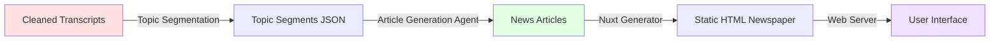
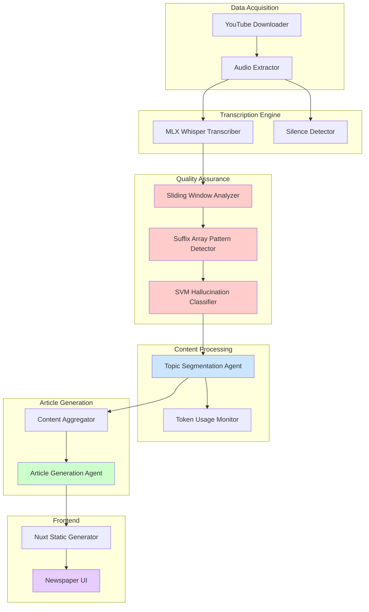
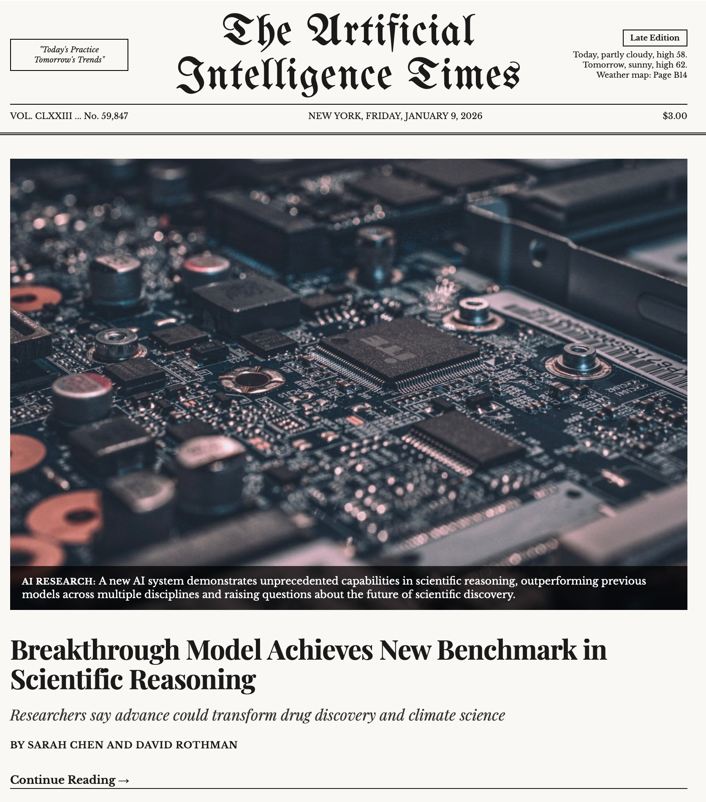

# Agentic News Generator - Technical Lightning Talk

## Motivation

The AI landscape is evolving at breakneck speed with hundreds of YouTube channels publishing daily updates, making it impossible for engineers to stay current. This system automatically aggregates, transcribes, and synthesizes AI-focused video content into a curated weekly digest, transforming information overload into actionable insights.

## Data Processing Pipeline

### Phase 1: Data Acquisition & Transcription


### Phase 2: Content Generation & Publishing



### Pipeline Artifacts

| Stage | Input | Output | Format | On Disk |
|-------|-------|--------|--------|---------|
| **Download** | YouTube URLs | Video files | `.mp4` | [`../data/downloads/videos/{channel}/`](../data/downloads/videos/) |
| **Audio Extraction** | Videos | Audio + silence maps | `.wav`, `.json` | [`../data/downloads/audio/{channel}/`](../data/downloads/audio/) <br> [`../data/downloads/metadata/{channel}/`](../data/downloads/metadata/) |
| **Transcription** | Audio | Multi-format transcripts | `.srt`, `.txt`, `.vtt`, `.tsv`, `.json` | [`../data/downloads/transcripts/{channel}/`](../data/downloads/transcripts/) |
| **Hallucination Detection** | Transcripts | Analysis + digest | `.json`, `.md` | [`../data/downloads/transcripts/{channel}/transcript-analysis/`](../data/downloads/transcripts/) <br> [`../data/output/hallucination_digest.md`](../data/output/hallucination_digest.md) |
| **Topic Segmentation** | Transcripts | Topic segments | `.json` | [`../data/output/topics/`](../data/output/topics/) |
| **Article Generation** | Topic segments | News articles | `.json` | [`../data/input/newspaper/articles.js`](../data/input/newspaper/articles.js) |
| **Web Generation** | Articles | Static website | `.html`, `.css`, `.js` | [`../data/output/newspaper/`](../data/output/newspaper/) |

## System Components


## Rendered Newspaper Website

The newspaper interface is organized into four main sections:

- **Hero Section**: The lead story displayed prominently at the top of the page with a large image, headline, subhead, byline, dateline, and opening paragraphs. This section highlights the most important article of the week.

- **Featured Articles (Top Stories)**: A grid layout showcasing key articles with images, headlines, and excerpts. The first article in this section is displayed in a larger format to draw attention, while subsequent articles are shown in a standard card layout.

- **Articles Section**: Contains the main secondary article with full text content and sidebar columns featuring additional articles. This section provides depth and variety, allowing readers to explore multiple stories in a traditional newspaper column layout.

- **Briefs Section**: Multiple columns (National, International, Business, Arts & Culture) containing concise news briefs. Each brief includes a headline and summary text, enabling readers to quickly scan multiple topics at a glance.




## Technical Architecture Highlights

### Hallucination Detection System
- **Sliding Window Analysis**: 500-word windows with 25% overlap
- **Suffix Array Algorithm**: O(n log n) pattern detection for consecutive repetitions
- **SVM Classification**: Distinguishes hallucinations from natural speech patterns
- **Real-time Filtering**: Removes common speech patterns ("you know", "I think")

**Code:** [`scripts/transcript-hallucination-detection.py`](../scripts/transcript-hallucination-detection.py) | [`src/processing/repetition_detector.py`](../src/processing/repetition_detector.py) | [`src/models/hallucination_classifier.py`](../src/models/hallucination_classifier.py)

### Transcription Optimization
- **Model**: MLX Whisper large-v3 (Apple Silicon optimized)
- **Metadata Prompting**: Uses YouTube title/description for domain context
- **Silence Removal**: -40dB threshold, >2s minimum (10-30% time savings)
- **Anti-hallucination Parameters**: `hallucination_silence_threshold=2.0`, `compression_ratio_threshold=2.0`

**Code:** [`scripts/transcribe_audio.sh`](../scripts/transcribe_audio.sh) | [`scripts/convert_to_audio.sh`](../scripts/convert_to_audio.sh)

### Topic Segmentation
- **Agent-Critic Pattern**: Dual LLM validation for quality
- **Token Monitoring**: Pre-flight validation prevents context overflow
- **Threshold**: 90% of 262K context window (configurable)
- **Observability**: Logs token count and percentage for every API call

**Code:** [`src/agents/topic_segmentation/orchestrator.py`](../src/agents/topic_segmentation/orchestrator.py) | [`src/agents/topic_segmentation/agent.py`](../src/agents/topic_segmentation/agent.py) | [`src/agents/topic_segmentation/critic.py`](../src/agents/topic_segmentation/critic.py) | [`src/agents/topic_segmentation/token_validator.py`](../src/agents/topic_segmentation/token_validator.py)

### Article Generation
- **Content Aggregation**: Combines related topics across multiple videos
- **LLM-based Synthesis**: Generates newspaper-style articles
- **Source Tracking**: Maintains video timestamps and metadata

**Code:** [`src/processing/article_compiler.py`](../src/processing/article_compiler.py) | [`src/processing/article_parser.py`](../src/processing/article_parser.py) | [`src/models/article.py`](../src/models/article.py)

## Technical Decisions - Q&A

### Why YouTube videos as the primary source?
- **Rich content**: Technical discussions with visual context
- **High signal**: Curated channels with expert commentary
- **Metadata available**: Titles, descriptions enhance transcription accuracy
- **Standardized format**: Consistent processing pipeline
- **Timestamp precision**: Enables source linking and verification

### Why MLX Whisper instead of a cloud API?
- **Cost efficiency**: No per-minute API charges for large-scale processing
- **Data privacy**: Sensitive content stays on-premise
- **Apple Silicon optimization**: 2-3x faster on M1/M2/M3 chips via Metal acceleration
- **Quality control**: Full control over anti-hallucination parameters
- **Offline capability**: No internet dependency after model download

### Why not use an LLM for hallucination detection?
- **Computational efficiency**: Suffix array algorithm is O(n log n) vs LLM inference cost
- **Deterministic results**: Pattern matching provides reproducible detection
- **No false creativity**: LLMs might "fix" hallucinations instead of flagging them
- **Scale**: Can process 1000+ transcripts in minutes vs hours
- **Token costs**: Zero API costs vs $100s for corpus-wide analysis

### Why segment videos by topic instead of processing whole transcripts?
- **Context management**: Prevents LLM context window overflow
- **Content aggregation**: Combines related topics across multiple videos
- **Relevance filtering**: Focus on specific AI domains (e.g., "LLMs", "Computer Vision")
- **Article quality**: Tighter topic scope produces more coherent articles
- **Processing efficiency**: Parallel processing of independent segments

### Why generate a static HTML newspaper instead of a dynamic web app?
- **Zero infrastructure**: Deploy to any static host (GitHub Pages, Netlify, S3)
- **Performance**: Instant load times, no server-side rendering
- **Cost**: $0 hosting for unlimited readers
- **Reliability**: No database, no API, no points of failure
- **SEO-friendly**: Pre-rendered HTML for optimal indexing

### Why the 1950s New York Times aesthetic?
- **Credibility signaling**: Classic newspaper design implies authority and curation
- **Information density**: Maximizes content above the fold
- **Readability**: Proven typography and layout patterns
- **Differentiation**: Stands out from modern AI content aggregators
- **Nostalgia factor**: Appeals to technical audience's appreciation for vintage design

### Why not use RAG for content generation?
- **Temporal coherence**: Weekly digest requires synthesis, not retrieval
- **Cross-video aggregation**: RAG retrieves per-query, not across corpus
- **Narrative structure**: Articles need story arc, not fact retrieval
- **Topic evolution**: Tracks how ideas develop across multiple sources
- **Curation vs search**: Human-like editorial judgment, not keyword matching

### Why archive videos after processing?
- **Disk efficiency**: Videos are 50-100x larger than transcripts
- **Immutable artifacts**: Transcripts + silence maps enable timestamp reconstruction
- **Cost optimization**: Archive to cold storage (S3 Glacier, local HDD)
- **Reproducibility**: Keep metadata for regeneration if needed
- **Pipeline clarity**: Clean separation between active and archived content

## Performance Metrics

| Metric | Value | Impact |
|--------|-------|--------|
| **Transcription WER** | 12.7 (median) | 76% improvement over large-v3 |
| **Processing Speed** | 2-3x faster | Model optimization (medium.en vs large-v3) |
| **Silence Removal Savings** | 10-30% | Reduced transcription time |
| **Hallucination Detection** | 31/1072 files | 97% clean transcripts |
| **Pattern Detection Threshold** | Score ≥ 11 | Balances sensitivity and false positives |
| **Context Window Usage** | <90% | Prevents API failures, saves costs |

## Tech Stack

**Backend:**
- Python 3.12 + `uv` package manager
- MLX Whisper (Apple Silicon optimized)
- FFmpeg (audio extraction, silence detection)
- Suffix arrays + SVM (hallucination detection)
- tiktoken (token counting)

**Frontend:**
- Nuxt 3 (Vue framework)
- Static site generation
- Pure CSS (no UI framework)

**Infrastructure:**
- `just` command runner
- Git-based workflow
- Local LLM (LM Studio) or cloud API
- Static hosting (any CDN)

## Repository Structure

```
agentic-news-generator/
├── scripts/                    # Processing scripts
│   ├── yt-downloader.sh       # YouTube video acquisition
│   ├── convert_to_audio.sh    # Audio extraction + silence removal
│   ├── transcribe_audio.sh    # MLX Whisper transcription
│   ├── transcript-hallucination-detection.py
│   └── archive-videos.sh      # Cleanup and archiving
├── src/                        # Core processing logic
│   ├── processing/
│   │   └── repetition_detector.py  # Suffix array algorithm
│   └── config.py              # Configuration management
├── frontend/newspaper/         # Nuxt static site
│   ├── components/            # Vue components
│   ├── data/articles.js       # Generated content
│   └── assets/css/            # 1950s newspaper styling
├── config/
│   └── config.yaml            # 16 pre-configured AI channels
└── data/
    ├── downloads/             # Videos, audio, transcripts
    ├── archive/               # Processed videos
    └── output/                # Generated articles + website
```

## Future Enhancements

- **Visual integration**: Extract keyframes for article images
- **Interactive player**: Embedded video with auto-skip to timestamp
- **Source linking**: Click article text to see original video moment
- **Relevance ranking**: Order topics by user interests/reading history
- **Multi-format output**: Email digest, RSS feed, mobile app

## Key Takeaways

1. **Hybrid approach wins**: Algorithmic detection + LLM synthesis > pure LLM pipeline
2. **Apple Silicon is a game-changer**: MLX enables production-grade ML without cloud costs
3. **Static generation scales**: Zero infrastructure for unlimited readers
4. **Quality gates matter**: Hallucination detection + token monitoring prevent garbage output
5. **Domain metadata helps**: YouTube context improves transcription accuracy by ~5-10%
